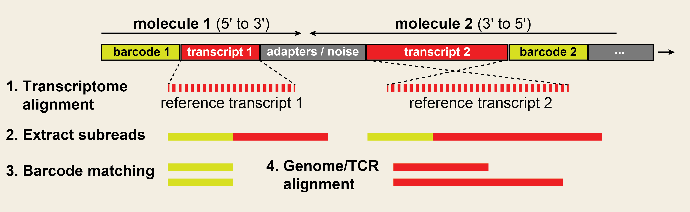

# nanoranger

*nanoranger* is a processing tool for long-read single-cell transcriptomics as described in our [Nature Communications](https://www.nature.com/articles/s41467-023-44137-7) paper, and spatial transcriptomics as described in our [Immunity](https://www.cell.com/immunity/pdf/S1074-7613(22)00415-0.pdf) paper.

## Workflow

The input data can be obtained through sequencing of 10x Genomics whole-transcriptome cDNA libraries or amplicons obtained through targeted amplification, sequenced with Oxford Nanopore Technologies (ONT) or Pacific Biosciences devices.The schematic of our workflow is demonstrated below.



If you have a question about the software, or have any suggestions or ideas for new features or collaborations, feel free to create an issue here on GitHub, or write an email to mborji@broadinstitute.org.

## Background

Two of the main challenges of ONT data analysis for single-cell applications have been (i) higher sequencing error compared to Illumina data and (ii) the variable location of cell barcodes and molecular identifiers (UMI) within each sequenced transcript. 

To overcome these challenges *nanoranger* introduces **two innovations**:

- The processing pipeline starts with alignment of reads to a transcriptome reference. This initial transcriptome alignment step enables orientation and extraction of 'subread' components - the transcript and the part of the read upstream or downstream of the transcript that contains barcode and UMI. <br><br>
By extracting flanking (soft-clipped) portions of a transcript it is possible to reliably assign cell barcodes to their transcript. This also limits the search space from a usually 200nt region at both ends of a read to a small 50nt part. This not only speeds up barcode matching, it also reduces the chance of assigning wrong barcodes to transcripts. <br><br>
Another feature automatically enabled by this approach is recovery and reliable quantification of fused/follow-on reads (also called informatic chimeras) generated abundantly in newer ONT chemistries (LSK112 and LSK114) by processing all supplementary transcript alignments for each read. This occasionally leads to extraction of 100s of supplementary transcripts from a single read. By accounting for such events we can recover as high as %50 more usable transcripts from the raw reads. A natural extension of this feature is processing and deconcatenation of libraries which are generated using concatenation methods, such as [MAS-ISO-seq](https://www.nature.com/articles/s41587-023-01815-7) and made commercially available as [Kinnex kit](https://www.pacb.com/wp-content/uploads/Application-note-Kinnex-single-cell-RNA-kit-for-single-cell-isoform-sequencing.pdf).<br><br>
- To perform barcode matching while accounting for indels and mismatches, *nanoranger* uses an aligner-based technique by aligning barcode components of the subreads against a reference of known barcodes (such as 737K whitelist for 10x Genomics 5' libraries included here). <br>Compared to techniques which solely rely on adapter identification, this approach can avoid missed or erroneously assigned barcodes due to frameshifts introduced by errors in flanking adapters. To achieve this *nanoranger* uses STAR with a number of changes to the default options. The primary modification is change of the alignment mode to EndToEnd instead of the default softclipping in the unaligned ends of a read to force all bases of the barcode candidates to be mapped to the reference. Simultaneously, *nanoranger* pads the whitelist of barcodes with unknown nucleotides to avoid penalizing the adapter and UMI sequences which are kept in the barcode candidate reads.

There are different quantification 'modes' available for different libraries structures and tasks and the transcriptome reference can be modified accordingly. For whole transcriptome gene expression analysis a GENCODE transcriptome reference can be used . For 5' immune profiling this can be reduced to a reference of V transcripts and similarly for 3' immune profiling this can be a reference of C transcripts. If a set of targets is used for enrichment from cDNA, to speed up analysis one can only use a reference for those transcripts that are expected to be present.

nanoranger has been primarily tested on targeted libraries generated using 10X 5' Chromium and slide-seq 3' platforms. It can be used for immune profiling and genotyping from other library types with minimal modifications. 

Further developments for generating count matrices for whole transcriptome libraries as well as addition of other chemistry types are currently underway.

## Software Dependencies 
This tool has been tested on Python 3.7.10 under Centos and Ubuntu systems.

The following programs are also assumed to be in path when running the tool. Please refer to the provided link for each to install them prior to start of your data analysis using this tool. Alternatively they are available as bioconda packages.

[STAR](https://github.com/alexdobin/STAR) is used for barcode correction against a set of known barcodes. By certain input parameter changes we use STAR in a Smith-Waterman-like mode.

[minimap2](https://github.com/lh3/minimap2) is used for initial alignment of raw nanopore reads to a transcriptome and (subsequently based on operation mode) alignment to a genome. 

[SAMtools](http://www.htslib.org/download/) is used for sorting and indexing BAM files

[pigz](https://zlib.net/pigz/) is used for compressing output and intermediate fasta and fastq files.

[MiXCR](https://github.com/milaboratory/mixcr) is used for VDJ alignment and clonotype extraction. We have strictly used MiXCR v3 in validating and benchmarking the results against Illumina-based data. Latest versions of MiXCR are not fully tested with our workflow and seem not be compatible out of the box without tunning parameters.

[SeqKit](https://bioinf.shenwei.me/seqkit/) is used for splitting input fastq files in case of very large libraries or libraries prepared with cDNA concatenation. Deconcatenation speed-up is achieved by parallel processing of splitted input files. To enable this step set the optional boolean flag --split.


## Download and Install
```
git clone https://github.com/mehdiborji/nanoranger.git
cd nanoranger
chmod -R +x *
pip install -r requirements.txt

```
## Sample Input Commands For Different Modes

### The pipeline supports different chemistries through --mode flag

#### 3pXCR_slideseq

- Analysis of **TCR/BCRs** from a **slide-seq (Curio)** spatial transcriptomics library (Human and Mouse *C gene* transcripts available in data folder and provided to the pipeline with flag `--t` and VDJ alignment supported by MiXCR 3)

```
python ~/nanoranger/pipeline.py \
        --c 8 \
        --i ~/nanoranger/sample_fastq/slideseq_XCR.fastq.gz \
        --o XCR \
        --e Puck_220509_18 \
        --m 3pXCR_slideseq \
        --b ~/nanoranger/data/slideseq.matched.barcodes.tsv.gz \
        --t ~/nanoranger/data/XR_C_mouse.fa \
        --x mmu
```

#### 5p10XTCR

- Analysis of **TCRs** from a **10x genomics Chromium 5'** library (Human and Mouse *V gene* transcripts available in data folder and provided to the pipeline with flag `--t` and VDJ alignment supported by MiXCR 3)

```
python ~/nanoranger/pipeline.py \
        --c 8 \
        --i ~/nanoranger/sample_fastq/TCR3.fastq.gz \
        --o TCR \
        --e TCR \
        --m 5p10XTCR \
        --t ~/nanoranger/data/TR_V_human.fa \
        --x hsa
```

#### 5p10XGEX

- Generation of **BAM** with barcode and UMI tags for variant calling from a **10x genomics Chromium 5'** library (GRCh38.primary_assembly.genome.fa.gz from https://www.gencodegenes.org/human/ can be used)
```
python ~/nanoranger/pipeline.py \
        --c 8 \
        --i ~/nanoranger/sample_fastq/1022_DNMT3A_RUNX1_SF3B1.fastq.gz \
        --o AML_1022 \
        --e DNMT3A_RUNX1_SF3B1_AML_1022 \
        --m 5p10XGEX \
        --t ~/nanoranger/data/panel_MT_trns.fa \
        --g ~/refs/GRCh38.primary_assembly.genome_v41.fa.gz
```

- Detection of **known fusions** from a **10x genomics Chromium 5'** library (for fusions we may skip genome alignment by realigning the extracted transcripts to the initial transcriptome reference)

```
python ~/nanoranger/pipeline.py \
        --c 8 \
        --i ~/nanoranger/sample_fastq/K562_Kasumi1_BCRABL1_RUNX1_RUNX1T1.fastq.gz \
        --o K562_Kasumi1 \
        --e fusion \
        --m 5p10XGEX \
        --t ~/nanoranger/data/RUNX1_RUNX1T1_ABL1_BCR.fa \
        --g ~/nanoranger/data/RUNX1_RUNX1T1_ABL1_BCR.fa
```

- Analysis of **MT transcripts in 15-mer MAS-seq arrays** from a **10x genomics Chromium 5'** library (we may skip whole genome alignment by realigning the extracted transcripts just to the mitochondrial chromosome)
```
python ~/nanoranger/pipeline.py \
        --c 8 \
        --i ~/nanoranger/sample_fastq/1019_mtDNA.fastq.gz \
        --o AML_1019 \
        --e mito_15mer_AML_1019 \
        --m 5p10XGEX \
        --t ~/nanoranger/data/MT_trns.fa \
        --g ~/nanoranger/data/MT_chr.fa
```

- Analysis of CAR-T cells from a **10x genomics Chromium 5'** library to **detect CAR and CD28** transcripts
```
python ~/nanoranger/pipeline.py \
        --c 8 \
        --i ~/nanoranger/sample_fastq/97_6_CAR.fastq.gz \
        --o 97_6 \
        --e CAR_97_6 \
        --m 5p10XGEX \
        --t ~/nanoranger/data/CAR_CD28.fa \
        --g ~/nanoranger/data/CAR_CD28.fa
```

- Generation of **BAM** with barcode and UMI tags and **genes-by-cells matrix** from a **10x genomics Chromium 3'** library (GRCh38.primary_assembly.genome.fa.gz from https://www.gencodegenes.org/human/ can be used)

```
Coming Soon!
```

#### 3p10XGEX
- Generation of **BAM** with barcode and UMI tags and **genes-by-cells matrix** from a **10x genomics Chromium 3'** library (GRCh38.primary_assembly.genome.fa.gz from https://www.gencodegenes.org/human/ can be used)

```
Coming Soon!
```

#### 3p10XTCR
- Analysis of **TCRs** from a **10x genomics Chromium 3'** library (Human and Mouse C gene transcripts available in data folder and alignment supported by MiXCR)

```
Coming Soon!
```

## Downstream Analysis

- Scripts for downstream analysis on the outputs of this pipeline is available through https://github.com/liviuspenter/nanoranger.R


